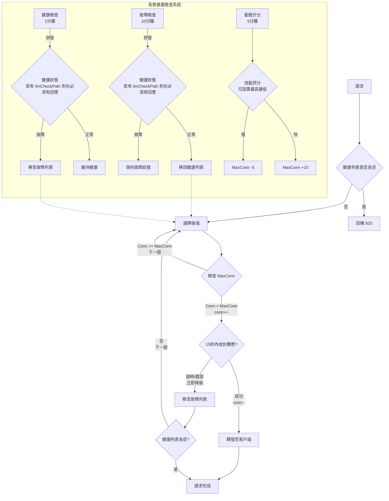

- 1 分鐘健康檢查 / 10 分鐘故障恢復 / 5 分鐘 MaxConn 動態調整
- 請求時間 + Ping延遲 + 響應速度 + LLM 延遲加權計算
- 連線池
- 記憶體預分配
- 動態調整 MaxConn
- 故障/超時立即降級，0 延遲重試下個後端
- proxypass 處理請求，timer 處理健康檢查
- 提供 `healthPath` / `llmCheckPath` 參數用於提供自訂路徑檢查健康與 LLM 響應速度
- `llmCheckPath`: 最小 token 測量 API 延遲
- 故障 Email 通知

